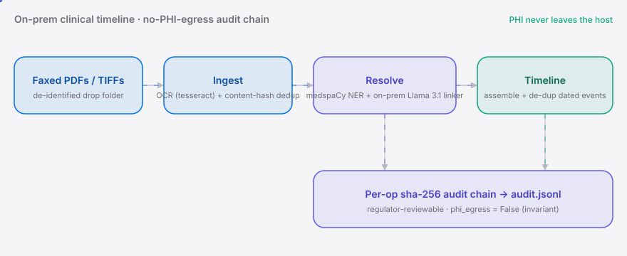

<div align="right"><sub><b>EN</b>&nbsp;&nbsp;⇄&nbsp;&nbsp;<a href="./README.zh-CN.md">中文</a></sub></div>

<p align="center">
  <picture>
    <source media="(prefers-color-scheme: dark)" srcset="./assets/hero-dark.svg">
    <source media="(prefers-color-scheme: light)" srcset="./assets/hero-light.svg">
    
  </picture>
</p>

<p align="center"><sub>The on-prem primitive turning faxed PHI into reviewable timelines for commercial AI agents.</sub></p>

<p align="center">
  <a href="./LICENSE"></a>
  <a href="https://github.com/SuperMarioYL/clinrec/releases"></a>
  <a href="https://github.com/SuperMarioYL/clinrec/actions/workflows/ci.yml"></a>
  
  
</p>

> **ClinRec turns a folder of faxed and scanned medical records into a
> de-duplicated, regulator-reviewable clinical timeline on a single host —
> PHI never leaves the box, every extraction step is sha-256 audit-stamped.**

<h2> Architecture</h2>

<p align="center">
  <picture>
    <source media="(prefers-color-scheme: dark)" srcset="./assets/atlas-dark.svg">
    <source media="(prefers-color-scheme: light)" srcset="./assets/atlas-light.svg">
    
  </picture>
</p>

Two processes only: the `clinrec` CLI/TUI and a local [Ollama](https://ollama.com) daemon. No microservices, no cloud calls, no Kubernetes. The genuinely new surface of the primitive is the **on-prem LLM linker** that normalizes messy OCR spans to coded entities with zero cloud calls, plus the **per-op audit chain** that lets a regulator reconstruct every extraction step from local sha-256 artifacts.

## Why this exists

Clinical AI teams at hospitals, payers, and med-mal law firms independently rebuild the same ingestion layer: taking faxed and scanned medical-record PDFs and reconstructing them into a clinically accurate, regulator-reviewable timeline while keeping PHI on-prem. The verb that fails today is *resolve* — entity resolution across duplicate faxes, free-text encounters, and partial structured fields into a single timeline. The concrete action that breaks: a clinical engineer hands a multi-thousand-page faxed record set to a hosted RAG stack and either trips a HIPAA breach (PHI leaves site) or gets an answer with no audit trail and no duplicate-fax de-duplication.

ClinRec is the agent-facing CLI surface that wires into your agent pipeline so a clinical-AI engineer runs one on-prem primitive instead of rebuilding this layer in-house — it rides the broad **Agent** backbone (the v0.57 trend that [affaan-m/ECC](https://github.com/affaan-m/ECC) also sits on), built for clinical-timeline extraction. An Ai primitive whose quality bar is falsifiable on a de-identified n2c2 set, not a black box: `clinrec eval` reports on-prem NER+linker precision/recall vs a medspaCy-only baseline, and the plan says kill if it does not clear that bar.

## Table of contents

- [Architecture](#architecture)
- [Why this exists](#why-this-exists)
- [Install](#install)
- [Quickstart](#quickstart)
- [Usage](#usage)
- [Demo](#demo)
- [Configuration](#configuration)
- [vs adjacent tooling](#vs-adjacent-tooling)
- [Pricing — ClinRec Pro](#pricing--clinrec-pro)
- [Roadmap](#roadmap)
- [License](#license)
- [Share this](#share-this)

<h2> Install</h2>

```bash
# Python 3.12 + uv recommended (pip works too)
uv tool install clinrec
ollama pull llama3.1:8b-instruct      # one-time, hands-off model pull
```

<h2> Quickstart</h2>

```bash
clinrec init                           # detect Ollama, load medspaCy, write ./clinrec.toml
clinrec ingest ./sample-records        # OCR + dedup + NER + link + assemble a timeline
clinrec timeline                       # Rich TUI: browse de-duplicated events + audit chain
```

<details><summary>sample output</summary>

```
                      Ingest summary
┌──────────────────────────┬─────────────────────────────┐
│ records                  │ 5                           │
│ duplicates skipped       │ 1                           │
│ entities (coded)         │ 85                          │
│ timeline events (de-dup) │ 37                          │
│ audit entries            │ 128                         │
│ phi_egress               │ False (primitive invariant) │
│ NER engine               │ medspaCy                    │
│ linker engine            │ rule-based (ollama down)    │
│ state                    │ .clinrec/state.json         │
└──────────────────────────┴─────────────────────────────┘
```
</details>

<h2> Usage</h2>

The five most common workflows. Full reference: `clinrec --help`.

```bash
# 1. ingest a folder of faxed/scanned records (PDF/TIFF/PNG/TXT)
clinrec ingest ./faxes --patient patient-deid-001

# 2. browse the assembled timeline (Rich TUI): pick an event to drill into
#    its evidence spans, or dump the full audit chain
clinrec timeline

# 3. export the regulator-reviewable audit log (JSON-lines, one entry per op)
clinrec audit --export audit.jsonl
clinrec audit --show                  # print the chain to stdout instead

# 4. killer-falsifier eval: on-prem NER+linker vs medspaCy-only baseline
clinrec eval                          # embedded curated gold set
clinrec eval --gold tests/gold.jsonl  # your own gold JSON-lines

# 5. programmatic API (for an agent pipeline)
python -c "
from clinrec.timeline import TimelineAssembler
from clinrec.resolve import EntityExtractor
from clinrec.llm import Linker
from clinrec.audit import AuditChain
from clinrec.ingest import ingest_folder

records, dedup = ingest_folder('./sample-records')
asm = TimelineAssembler(extractor=EntityExtractor(), linker=Linker(), audit=AuditChain())
timeline = asm.assemble(records, patient_pseudonym='patient-deid-001')
print(f'{len(timeline.events)} de-duplicated events; phi_egress invariant:', asm.audit.verify_invariant())
"
```

Each user-typed step is under 60 seconds; the model pull is the only wait and it is hands-off.

<h2> Demo</h2>

<p align="center">
  
</p>

The 10-minute happy path (`docs/demo.tape` rendered by `.github/workflows/demo.yml`): `clinrec init` → `clinrec ingest ./sample-records` → `clinrec timeline` (browse de-duplicated events, drill into evidence spans, view the audit chain) → `clinrec audit --export audit.jsonl` → `clinrec eval --gold tests/gold.jsonl`. Single GPU, no PHI egress.

<h2> Configuration</h2>

`clinrec init` writes a minimal `./clinrec.toml` (operator-managed, never shipped). The top-level keys:

| key | type | default | meaning |
|---|---|---|---|
| `ollama_host` | str | `http://127.0.0.1:11434` | Ollama daemon URL (on-prem only) |
| `ollama_model` | str | `llama3.1:8b-instruct` | on-prem linker model tag |
| `state_dir` | str | `.clinrec` | local working state (JSON, reviewable) |

When Ollama is unreachable the linker degrades to a deterministic rule-based coder so the CLI still produces a usable, fully-audited timeline — the audit chain records which path produced each code (`llm_model_id` distinguishes `llama3.1:8b-instruct` from `rule-based`).

## vs adjacent tooling

ClinRec vs [affaan-m/ECC](https://github.com/affaan-m/ECC) (the agentic-eval harness in this lane). Honest positioning — they are complementary categories, not head-to-head clones.

| feature axis | ClinRec | affaan-m/ECC |
|---|:---:|:---:|
| on-prem PHI, zero cloud calls | ✓ | — |
| clinical entity resolution (medspaCy NER + coded linker) | ✓ | — |
| agent-eval harness / benchmarking agents | partial | ✓ |
| per-op sha-256 audit chain (regulator-reviewable) | ✓ | partial |
| de-duplicated clinical timeline assembly | ✓ | — |

ECC is the better tool for benchmarking agentic coding; ClinRec is the agent-facing CLI surface for clinical-timeline extraction with a regulator-reviewable audit chain.

<h2> Pricing — ClinRec Pro</h2>

The OSS primitive is free. **ClinRec Pro** is the paid tier for hospital IT — managed on-prem deployment plus a regulator-grade audit pack. This is the honest monetization for a HIPAA-bound on-prem tool: PHI never touches our infrastructure, so we sell the deployment + attestation, not a PHI-leaking SaaS.

| tier | what you get | price |
|---|---|---|
| **ClinRec OSS** | the primitive, the eval harness, the de-identified sample | free |
| **ClinRec Pro — managed on-prem** | single-tenant deployment in your VPC / on your GPU box (PHI stays in your environment, never ours) + SOC2-aligned audit export + quarterly eval rerun + SLA | ~$2,500/mo per managed on-prem instance (~$24k/yr prepaid) |
| **ClinRec Pro — audit pack only** | validation reports + SOC2-aligned audit export + quarterly eval rerun, for teams that self-host the OSS | ~$8k/yr |

Billing is for the deployment + attestation contract — PHI never touches the payment stack. The smallest "yes, here's my credit card" path: cold-email a design partner, walk through `clinrec audit --export audit.jsonl` on their de-identified sample (the audit log sells to their compliance/IT buyer), convert a 30-day managed-on-prem pilot to $2,500/mo on day 31.

<h2> Roadmap</h2>

- [x] **m1 — ingest + clinical NER + on-prem linker.** OCR + content-hash dedup + medspaCy NER + the on-prem Llama 3.1 8B linker over a de-identified n2c2 sample, plus the `clinrec eval` killer-falsifier harness.
- [x] **m2 — timeline assembly + audit chain + Rich TUI.** Coded entities → dated normalized events, the per-op sha-256 audit chain (no-PHI-egress invariant), the Rich timeline browser, and `clinrec audit --export`. The shippable v0.1 artifact.
- [ ] **m3 — FHIR R4 export + cross-provider MPI + ClinRec Pro compliance pack.** FHIR R4 bundle export, cross-provider master-patient-index merge, and the managed-deployment + compliance-pack offering. Post-v0.1.
- [ ] design-partner pilots with clinical-AI eng leads (ViyaMD / Credo Health / SmarterDx / Weave Bio / DrSwarm).
- [ ] medspaCy ecosystem integration — get ClinRec listed as the timeline + audit companion.

## License

[MIT](./LICENSE). File issues and PRs at [github.com/SuperMarioYL/clinrec/issues](https://github.com/SuperMarioYL/clinrec/issues).

## Share this

```
ClinRec — the on-prem primitive turning faxed PHI into a regulator-reviewable clinical timeline (medspaCy + llama3.1:8b linker, per-op sha-256 audit). An Ai primitive with a falsifiable quality bar, built for your agent pipeline. https://github.com/SuperMarioYL/clinrec
```

<p align="center"><sub><a href="./LICENSE">MIT</a> © 2026 SuperMarioYL</sub></p>
