[English](README.md) | **简体中文**

<picture>
  <source media="(max-width: 640px) and (prefers-color-scheme: dark)" srcset="assets/presentation/hero-mobile-dark.svg">
  <source media="(max-width: 640px)" srcset="assets/presentation/hero-mobile-light.svg">
  <source media="(prefers-color-scheme: dark)" srcset="assets/presentation/hero-dark.svg">
  
</picture>

**ClinRec 将本地记录经过文本去重、实体抽取和编码关联整理成时间线，并保留原文位置及各处理步骤的哈希记录。**

`Python 3.12+` · [MIT](LICENSE) · [GitHub](https://github.com/SuperMarioYL/clinrec) · [网站](https://clinrec.lei6393.com)

## 为什么需要它

同一记录可能重复出现，不同日期的事件又分散在多份文件中。先消除相同文本的重复，再把事件与证据放在一起，可以减少复核时来回查找文件的负担。软件抽取结果仍需专业复核，不能把一份处理日志当成临床正确性或合规认证。

<picture>
  <source media="(max-width: 640px) and (prefers-color-scheme: dark)" srcset="assets/presentation/process-mobile-dark.svg">
  <source media="(max-width: 640px)" srcset="assets/presentation/process-mobile-light.svg">
  <source media="(prefers-color-scheme: dark)" srcset="assets/presentation/process-dark.svg">
  
</picture>

## 架构

ingest 按文件类型提取文本，dedup 计算规范化文本哈希。resolve 使用 medspaCy 或 regex 路径抽取实体，Linker 使用配置的 Ollama 或规则回退。TimelineAssembler 合并编码、日期及证据，State 保存 JSON；AuditChain 记录每步输入/输出哈希并链接前一条记录。

<picture>
  <source media="(max-width: 640px) and (prefers-color-scheme: dark)" srcset="assets/presentation/architecture-mobile-dark.svg">
  <source media="(max-width: 640px)" srcset="assets/presentation/architecture-mobile-light.svg">
  <source media="(prefers-color-scheme: dark)" srcset="assets/presentation/architecture-dark.svg">
  
</picture>

## 安装

需要 Python 3.12+。完整安装包括 NLP/OCR 客户端依赖；图片 OCR 还需系统 Tesseract。TXT 示例不需要 OCR 或模型权重。

```bash
git clone https://github.com/SuperMarioYL/clinrec.git
cd clinrec
python3 -m venv .venv
source .venv/bin/activate
python -m pip install -e .
```

## 快速开始

```bash
python examples/presentation_demo.py
```

脚本在临时目录创建三份虚构 TXT，其中一份仅大小写和空白不同。实际保留 2 条记录、跳过 1 条重复，使用规则 linker 得到 3 个事件和 13 条完整哈希链记录。本次运行的 NER 是 regex 回退；安装 medspaCy 后 ner_engine 字段会体现相应路径。

## 用法

```bash
# 按你的部署准备 Ollama 后，写入配置
clinrec init
clinrec ingest ./sample-records --patient fictional-example
clinrec timeline
clinrec audit --export audit.jsonl
clinrec eval --gold tests/gold.jsonl
```

命令可能使用配置的 Ollama 服务。先用虚构样本验证环境与输出，再决定自己的接入流程；本次演示没有运行远程服务、OCR 或 gold-set 评测。

## 能力与集成

| 环节 | 实际能力 |
|---|---|
| TXT/MD | 读取文本 |
| RTF | striprtf 提取 |
| PDF | pdfplumber 读取文本层 |
| 图片 | pytesseract OCR，需外部 Tesseract |
| NLP/Linker | medspaCy/regex 与 Ollama/规则回退 |
| 输出 | 时间线、JSON 状态、JSONL audit、终端浏览 |

<picture>
  <source media="(max-width: 640px) and (prefers-color-scheme: dark)" srcset="assets/presentation/integrations-mobile-dark.svg">
  <source media="(max-width: 640px)" srcset="assets/presentation/integrations-mobile-light.svg">
  <source media="(prefers-color-scheme: dark)" srcset="assets/presentation/integrations-dark.svg">
  
</picture>

## 配置与边界

| clinrec.toml 键 | 默认 |
|---|---|
| ollama_host | http://127.0.0.1:11434 |
| ollama_model | llama3.1:8b-instruct |
| state_dir | .clinrec |

默认模型地址在回环接口，但代码允许配置其他地址；没有网络隔离或流量监控机制。audit 的 phi_egress 是记录字段，其 False 值不证明数据绝未出机。

去重会折叠空白并忽略大小写，不是模糊语义去重。PDF 路径不自动对无文本层页面执行 OCR；抽取失败可能被记录后跳过。实体规则和编码映射覆盖有限，日期关联采用启发式，需核对原始 evidence spans。

## 运行记录

v0.7.0 的本地构造样例。脚本保留一个不监听的回环端口，令真实 linker 使用已实现的规则回退；没有调用模型。结果不验证真实病历质量、OCR、模型效果或监管要求。

[输入、命令和完整输出](docs/demo-results.json)

[保留的历史终端录屏](assets/demo.gif) · [录制脚本](docs/demo.tape)。本轮示例以以上可重放记录为准。

## 路线图

- [x] 文本/图片输入处理与规范化文本去重。
- [x] 实体抽取、编码关联、证据和时间线组装。
- [x] JSON 状态、链接哈希记录、终端浏览与评测入口。
- [ ] FHIR 导出、跨提供方患者匹配等扩展。

当前没有已交付的托管套餐、服务 SLA 或合规认证。

## 开发与许可证

```bash
python -m pip install -e ".[dev]"
python -m pytest
```

评测接口见 [docs/eval.md](docs/eval.md)，实际样本和指标需自行核查。

[MIT](LICENSE) · [Issues](https://github.com/SuperMarioYL/clinrec/issues)
